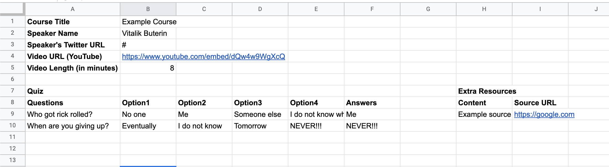

# Learn-2-Earn Quizmaster
This is the admin application to upload, edit and manage courses for the L2E app.

## Creating a New Course
All new courses are uploaded from an excelsheet (.xlsx), parsed and saved into the Moralis database. Parsing and saving the course properly is dependent on inputting the content into the correct cells within the excelsheet. 

Here is an example of how the excelsheet should be structured:


You can upload multiple courses at once by having multiple sheets in a single .xlsx file. Each sheet MUST follow the same structure as the image above with each input in the same cell. Once you press submit, the app will loop through each sheet and save them as courses to the Moralis database.

## Editing a Course
You can edit an existing course in the Moralis database in the edit page. You can edit all aspects directly in the app including the course title, video URL, each question, the options and the answers.

## Design
The development of the UI is based on the design proposal found [here](https://www.figma.com/file/tB5If4aq8GRB0cAsnxkyek/ECH-Learn2Earn?node-id=0%3A1).

## Tech Stack
The proposed technologies to be used for the initial version of this app are the following:
- [NextJS](https://nextjs.org/)
- [Chakra UI](https://chakra-ui.com/)
- [Moralis](https://moralis.io/)
- [POAP](https://poap.xyz/)

These were initially proposed for the sake of ease and fast development. The tech stack can be changed and improved as development evolves. Any proposals for other technologies can be submitted in the issues or suggested in the ECH discord server.

## Moralis
All the data including users, course content, and POAP info will be stored in the Moralis server database as separate collections. Here are the initially proposed schemas for an object in each type of collection:
- Users - Moralis automatically makes this object by defualt, but these attributes will be the most relevant for the L2E app.
```javascript
{
	ethAddress: ["0xExampleAddress"],
	email: "example@email.com (optional - for notifications)",
	coursesCompleted: [], // ID of object in Course collection (Relational)
	poapsEarned: [], // ID of object in POAP collection (Relational)
}
```
- POAPs - to store key information of each POAP for querying and managing.
```javascript
{
  	name: "POAP Name",
	source: "URL",
	mintLinks: ["mintlink", ...], // Delete each item from array after being used
	course: "Course ID", // ID of object in Course collection (Relational)
	previewImg: "Image source URL"
}
```
- Courses
```javascript
{
	videoUrl: "YouTube link",
	quiz: [
		{
			id: 1,
			question: "Question 1",
			options: ["Option 1", "Option 2", ...]
		},
		{
			id: 2,
			question: "Question 2",
			options: ["Option 1", "Option 2", ...]
		}
		// ..etc.
	],
	// Each answer is the index of the correct item for each "options" array within quiz object item
	answers: [1, 3, 0, 2, ...],
	responses: [
		{
			user: "USER ID", // ID of object in User collection (Relational)
			answers: [1, 3, 2, 1] // Index of chosen option per answers object
		}
	],
	poap: "POAP ID" // ID of object in POAP collection (Relational)
}
```

## Getting Started
This is a [Next.js](https://nextjs.org/) project bootstrapped with [`create-next-app`](https://github.com/vercel/next.js/tree/canary/packages/create-next-app).

First, run the development server:

```bash
npm run dev
# or
yarn dev
```

Open [http://localhost:3000](http://localhost:3000) with your browser to see the result.
